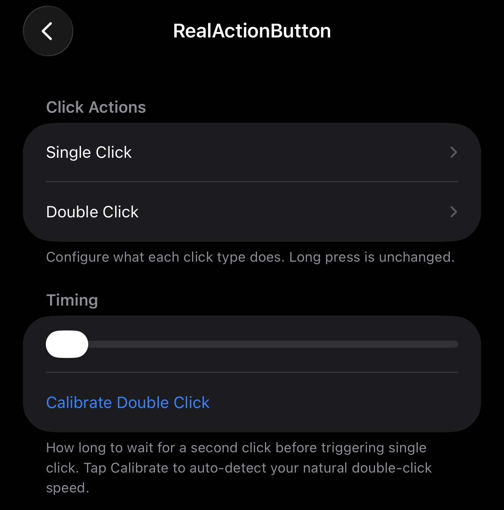

# RealActionButton
Bring single click and double click to your Action button while still keeping your holding option for system default. Support iOS 17-26
- (Tested on 15 Pro and 16 Pro Max, rootless only)
- Side story: I was keep finding why did it not works on iOS 26, it was funny that Apple changed `SBRingerHardwareButton` on iOS 17 and 18 to `SBActionHardwareButton` on iOS 26...

# Preview

